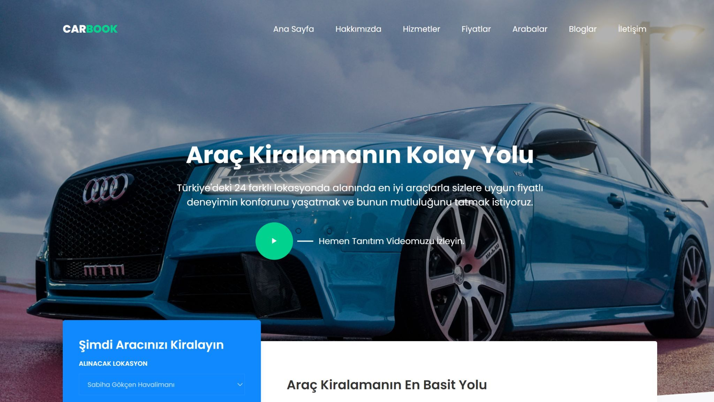
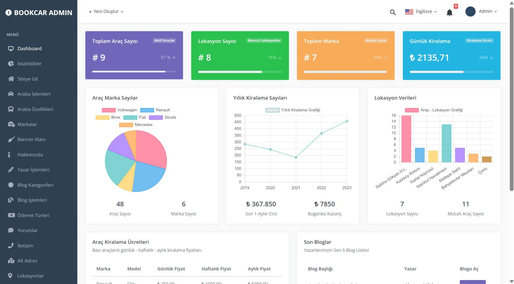
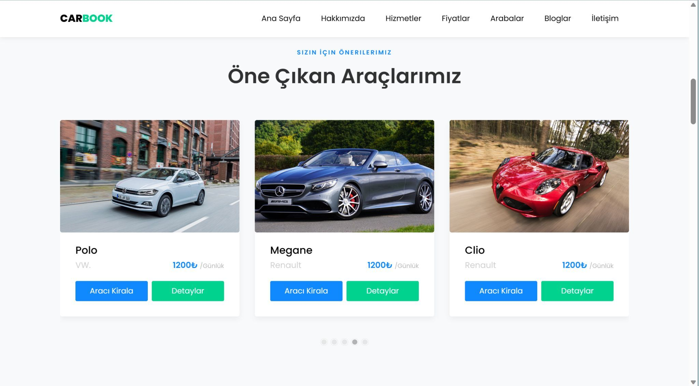
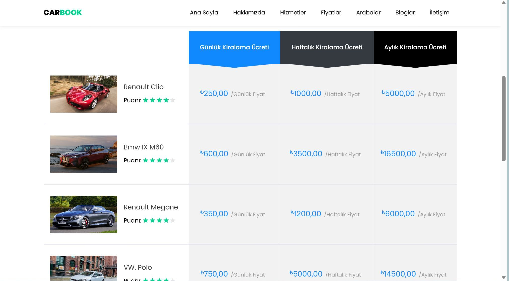
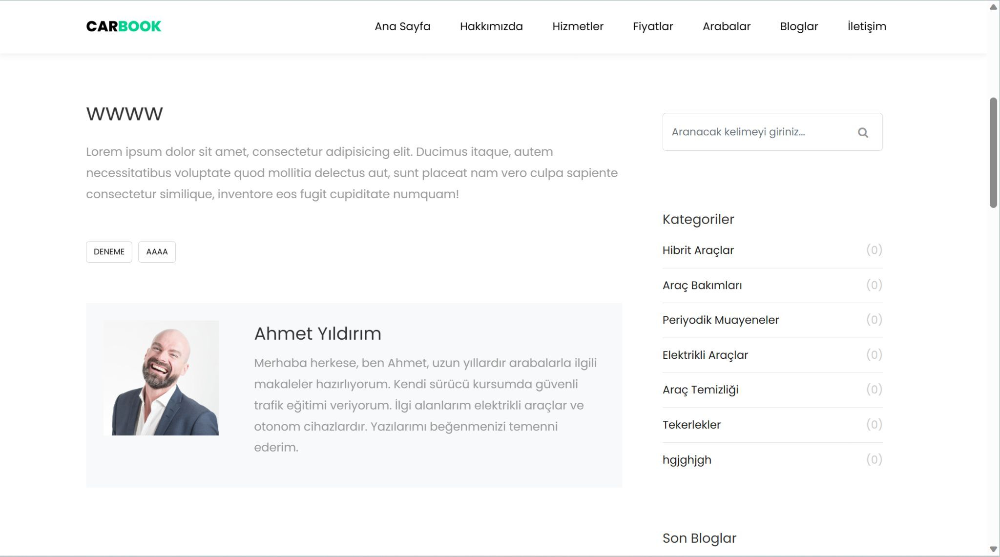
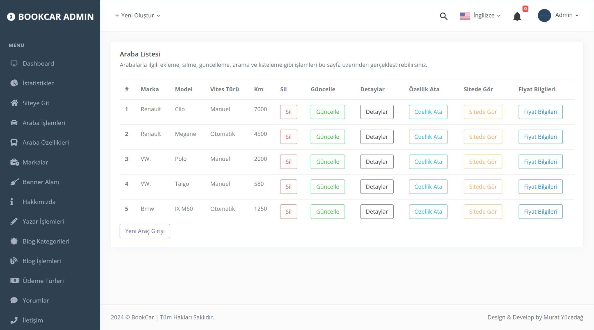
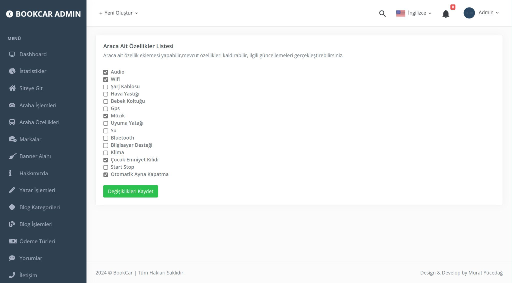
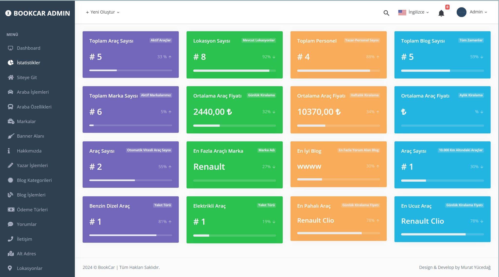
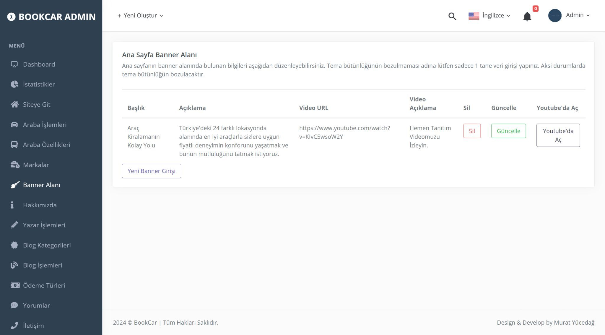
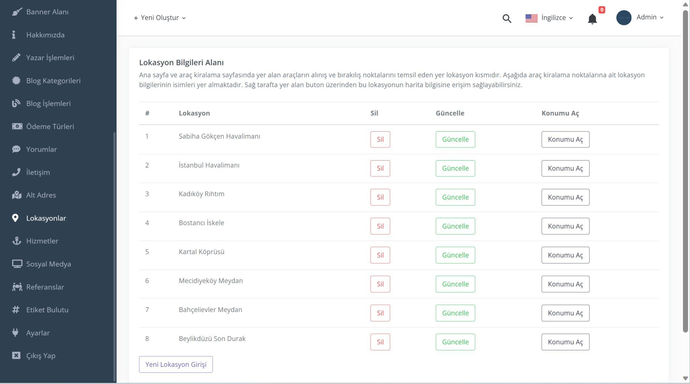

**Proje Açıklaması: Lokasyona Göre Araç Kiralama Uygulaması**

Bu proje, kullanıcıların belirledikleri lokasyona göre uygun araçları
listeleyebilecekleri ve istedikleri araca ön kayıt oluşturarak
kiralayabilecekleri bir web uygulamasıdır. ASP.NET Core 8.0 Web API ve
MVC kullanılarak geliştirilen proje, modern teknolojileri kullanarak
güçlü ve kullanıcı dostu bir deneyim sunar.

**Temel Özellikler:**

1.  **Araç Listeleme ve Kiralama:** Kullanıcılar, belirledikleri
    lokasyona göre müsait araçları listeleyebilir ve istedikleri aracı
    kiralayabilirler.

2.  **Araç Detayları:** Kullanıcılar, araçların detaylarını
    görüntüleyebilir ve özelliklerini inceleyebilirler.

3.  **Özellik Atama:** Araçlara özellik atama işlemi sayesinde
    kullanıcılar, araçları daha ayrıntılı bir şekilde
    filtreleyebilirler.

4.  **Admin Panel:** Yöneticiler, sistemi yönetmek ve kullanıcıları
    izlemek için özel bir yönetici paneline erişebilirler.

5.  **Canlı Veri Takibi:** SignalR teknolojisi kullanılarak, canlı veri
    takibi sağlanır ve kullanıcılara anlık bildirimler gönderilebilir.

6.  **Kimlik Doğrulama ve Yetkilendirme:** Json Web Token (JWT)
    kullanılarak, kimlik doğrulama ve yetkilendirme işlemleri güvenli
    bir şekilde gerçekleştirilir.

7.  **Mail Gönderme:** Kullanıcılar, sistemden aldıkları önemli
    bildirimler için e-posta yoluyla bilgilendirilirler.

8.  **Doğrulama Kontrolleri:** FluentValidation gibi araçlarla
    geliştirilen doğrulama kontrolleri, kullanıcıların giriş hatalarını
    minimize eder.

**Teknik Detaylar:**

-   **MSSQL Veritabanı:** Veri depolama için Microsoft SQL Server
    (MSSQL) kullanılır.

-   **Mimari Yapı:** Onion Architecture mimari yapısı kullanılarak,
    kodun modüler ve sürdürülebilir olması sağlanır.

-   **Design Patternler:** CQRS, Mediator, ve Repository design
    patternleri uygulanarak, kod tekrar kullanılabilirliği ve bakım
    kolaylığı sağlanır.

-   **Veri Transferi:** Sınıflar arası veri transferleri için AutoMapper
    kütüphanesi kullanılır.

-   **Geliştirme Araçları:** Swagger, geliştirme sürecini kolaylaştırmak
    ve API belgelendirmesini otomatikleştirmek için kullanılır.

Bu proje, kullanıcıların araç kiralama işlemlerini kolaylaştırmak için
tasarlanmış güçlü bir platform sunar. Hem kullanıcı dostu arayüzü hem de
güvenilir teknik altyapısıyla, lokasyona göre araç kiralama sürecini
optimize eder.

{width="6.525in"
height="3.683333333333333in"}{width="6.525in"
height="3.625in"}{width="6.525in"
height="3.6166666666666667in"}{width="6.525in"
height="3.6083333333333334in"}{width="6.525in"
height="3.6333333333333333in"}{width="6.525in"
height="3.625in"}{width="6.525in"
height="3.6083333333333334in"}{width="6.525in"
height="3.6333333333333333in"}{width="6.525in"
height="3.625in"}{width="6.525in"
height="3.6333333333333333in"}
